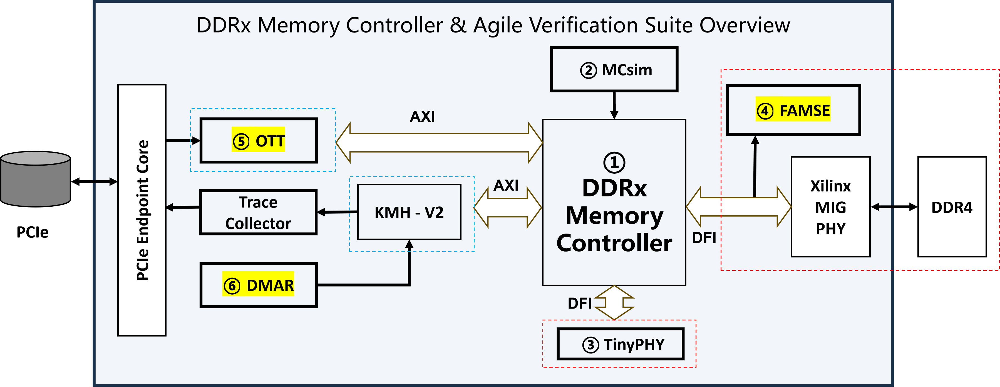

# YuQuan项目

面向流片的DDR3/DDR4/DDR5内存控制器及其敏捷开发与验证工具链

- [YuQuan项目](#yuquan项目)
  - [项目介绍](#项目介绍)
  - [开源版本说明](#开源版本说明)
  - [快速入门指南](#快速入门指南)
    - [DDR4 Baiyang-V0.9生成Verilog](#ddr4-baiyang-v09生成verilog)
    - [DDR4 Baiyang-V0.9 FPGA平台极简测试环境](#ddr4-baiyang-v09-fpga平台极简测试环境)
  - [开源路线图](#开源路线图)
    - [FAMSE](#famse)
    - [其他工具](#其他工具)

## 项目介绍

本项目旨在基于Chisel开发开源DDR3/4/5内存控制器，为香山开源生态提供高性能、可自主演进的开源内存控制器IP，并配套全栈式、系统化的敏捷开发与验证工具集。

内存控制器IP经过精心设计，具备以下特性：
1. **架构级参数化设计 — 支持可配置的结构参数，实现灵活定制**
2. **运行时参数与控制器功能解耦 — 实现模块化分解与独立优化**
3. **性能增强组件模块化集成 — 集成缓存、预取、过滤、调度等模块，支持多样化性能优化策略**
   
本项目还配套一系列敏捷开发和验证工具：
1. **内存控制器仿真器（MCSim） — 我们开发了时序精确、RTL对齐的仿真器，以加速内存控制器演进与架构探索**
2. **基于FPGA的真实DRAM周期精准内存子系统仿真器（FAMSE） — 该工具解决处理器核-内存频率倒挂问题，实现流片前的真实性能评估**
3. **外部踪迹测试器（OTT） — 该工具支持真实应用完整访存踪迹的高速重放，支持内存控制器满速压力测试**
4. **确定性内存地址重放器（DMAR） — 该工具支持跨平台确定性CPU内存踪迹采集与对比分析**
   
本项目拟开源的DDRx内存控制器及其敏捷验证套件如图1所示。部分工具现已开源（如MCSim、TinyPHY），其余工具计划开源（FAMSE、OTT、DMAR等），详见第四章开源路线图。
<figure>

<figcaption>
图 1 YuQuan: DDRx Memory Controller & Agile Development and Evaluation Suite
</figcaption>
</figure>

## 开源版本说明

当前开源分支为 `DDR4_baiyang_v0.9`，包含 Baiyang v0.9 版本代码。该IP支持：
。AXI4总线接口协议, Cacheline粒度读写
。DFI3.1 PHY总线接口协议
。DDR4-2400
详见《白杨IP设计文档-v8.0》。

该版本已完成与香山昆明湖-V2 核在 Cadence Palladium Z2 仿真平台上的集成。基于 SPEC CPU2006 基准测试（ref、整型+浮点），评估性能达到 14 分/GHz，接近商用内存控制器 IP 的性能水平。

相较 DDR4-Baiyang-V0.8，v0.9 的主要更新包括：
1. AXI2UI 新增 static virtual channel 支持，可在多 AXI ID 场景下提供受限的跨 ID out-of-order 返回；
2. SCG 路径新增 write mask 支持；
3. Filter 模块合并 write command queue 与 write data queue，并同步更新 UI write interface；
4. 修复 refresh 相关问题，包括 `tRP_timer` 问题和 burst refresh bug。
详细的 v0.8 到 v0.9 版本差异见随附的 `Key_changes.md` 变更说明。

上一版 DDR4-Baiyang-V0.8 已完成FPGA部署，并通过SPEC CPU2006基准测试（ref，整型+浮点）完整访存踪迹的满速压力测试。

当前已开源的敏捷开发与验证工具包括MCSim和TinyPHY。

MCSim是一款高度参数化的内存控制器仿真器，支持多样化架构配置与全面的性能分析。其关键指标在相同SPEC CPU2006 Trace条件下与DDR4-Baiyang-V0.8 高度吻合, 误差<5% 。

TinyPHY在FPGA平台上模拟DFI PHY功能，正确处理DFI接口读写请求，实现内存控制器与真实PHY的解耦，支持模块化快速验证。

详细文档及使用方法参见[TinyPhy](https://github.com/OpenXiangShan/MemoryTools/blob/master/TinyPHY/README.md) and [MCSim](https://github.com/OpenXiangShan/MCSim/blob/MCSim-v1.0/README.md)。

## 快速入门指南

### DDR4 Baiyang-V0.9生成Verilog

运行 make verilog 以生成 verilog 代码。该命令会在 build/ 目录下生成多个 .sv 文件。

更多信息详见 Makefile。

### DDR4 Baiyang-V0.9 FPGA平台极简测试环境

为方便部署 DDR4 Baiyang-V0.9 到 FPGA平台，我们搭建了集成 MicroBlaze核、Baiyang IP 和 可编程PHY模拟器 (TinyPHY) 的极简测试环境。

更多信息详见 Release版本 DDR4-Baiyang-fpga-V1.0.tar.gz 或 DDR4-Baiyang-fpga-V1.0.zip 的 .md 文件和Makefile。

## 开源路线图
### FAMSE
FAMSE拟于2026年7月1日开源。

通过协议转换、跨时钟域信号处理及存储介质命令管理等方法，FAMSE支持DFI PHY协议、多频点仿真及周期精准的访存时序，该工具解决两大关键挑战：

FPGA 平台缺少支持 DFI PHY 接口的 IP

FPGA 平台验证存在CPU降频 SDRAM芯片不降频的“频率倒挂”现象，导致CPU 性能测试结果不准确

### 其他工具

OTT等其他工具将于2026年下半年发布。我们同时计划于2026年下半年发布部分测试环境使用的上量访存踪迹(GB-to-TB级)。此外，我们计划开发DFI-master等更多工具以加速性能评估和架构演进。

我们诚邀致力于内存系统研究的开发者与研究人员携手同行，共建开源生态，加速从架构探索到硅片实现。
