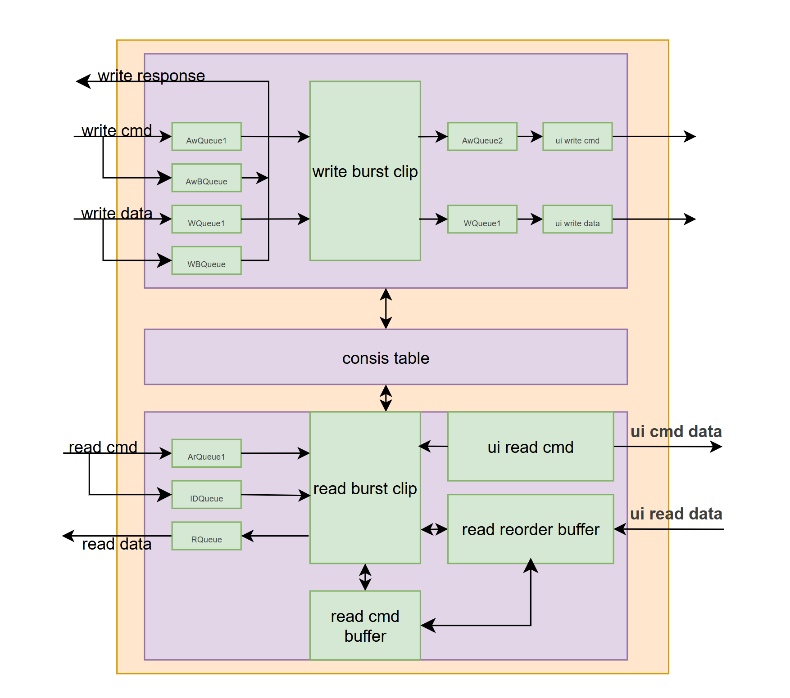
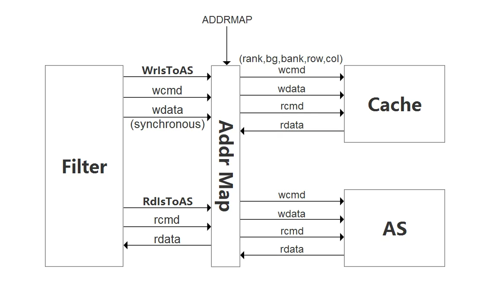
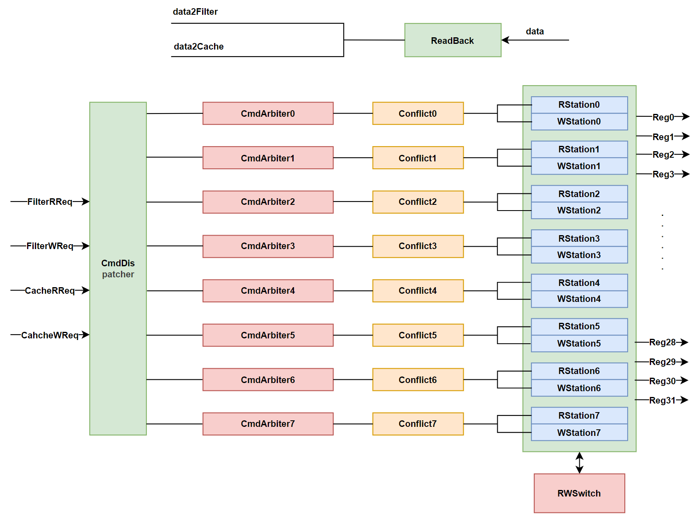
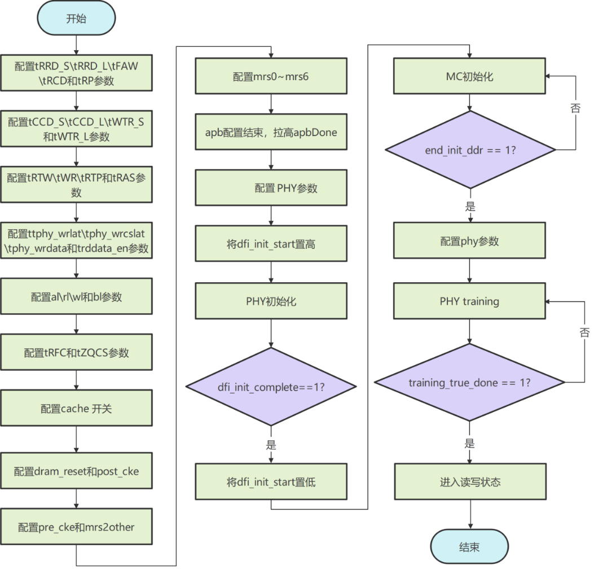

*  **
# Baiyang IP Design Document
*  **

- [Overview](#overview)
- [AXI2UI Design Specification](#axi2ui-design-specification)
- [Filter Design Specification](#filter-design-specification)
- [Addr Map Design Specification](#addr-map-design-specification)
- [System Cache Design Specification](#system-cache-design-specification)
- [Advanced Scheduler Design Specification](#advanced-scheduler-design-specification)
- [SDRAM Command Generator Design Specification](#sdram-command-generator-design-specification)
- [APBSlv Design Specification](#apbslv-design-specification)
- [Write data buffer Design Specification](#write-data-buffer-design-specification)
  - [维护](#维护)
  - [贡献者 ✨](#贡献者-)
  - [LICENSE](#license)

# Overview

The Open-Source high-performance memory controller IP (Yuquan first-generation “Baiyang” IP, Baiyang) includes functional modules such as address mapping, splitting, system cache, and scheduling. It supports DDR4-2400 memory frequency and is compatible with AXI4 and DFI3.1 protocols. In terms of functionality, its correctness has been verified through SPEC CPU2006 Full Trace memory access stress tests. In terms of performance, with the integrated Xiangshan Kunming Lake-v2 core, SPEC CPU2006 benchmark evaluation achieved up to 14.2 points/GHz under the Palladium verification environment.

The overall structure of Baiyang IP is shown in Figure1‑1, which includes protocol conversion, address mapping, traffic diversion, system cache, scheduling and command generation modules.

The AXI2UI module incorporates logical components including ar/aw/r/w/b channel buffers, arbitration, and registers. It decomposes AXI4-compliant read/write requests into UI (user interface) requests, which are then transmitted to the next level via read/write channels.Data read from the UI interface must be reordered before being returned to the AXI interface.

The AddrMap module adapts to different bank/row/col address combinations to parse SDRAM addresses (rank/bank/bank group/row/column).

After acquiring the read/write request address, the Filter module routes requests to either the Advanced Scheduler or the System Cache based on its filtering policy.

The System Cache module implements system-level caching to improve read and write performance.

The Advanced Scheduler module implements multi-bank scheduling for read and write requests, leveraging the bank switching feature of memory cells to reduce memory access latency.

The SDRAM Command Generator module manages DFI interface command scheduling and splitting, aligns with memory cell access timing requirements, and ensures memory read/write operations are correct.

The Global Write Data Buffer module caches all write data and retrieves it when the SDRAM Command Generator issues a DFI write request.

The detailed design of each module is shown in the following chapters.

<figure>

<figcaption>
Figure1‑1 Baiyang IP Architecture
Diagram
</figcaption>
</figure>

# AXI2UI Design Specification

The internal structure diagram of AXI2UI module is shown in Figure2‑1.

<figure>

<figcaption>
Figure2‑1 Internal Structure Diagram of the AXI2UI
Module
</figcaption>
</figure>

AXI2UI features include the following:

（1）Token generation: Generate a Token for each UI Read Command. The current version of the Read Token is exclusively used by the Read Reorder Buffer for reordering.

（2）AXI writes burst splicing: The current version only supports transactions with burst length 2 (field len set to 1) and AXI data width 256, which will be enhanced in future versions.

（3）Read Reorder Buffer: The Read Reorder Buffer reorders out-of-order read data returned by the DDRC into the correct sequence as specified by the AXI read command, then forwards it to the burst_clip for splitting. 

# Filter Design Specification

After acquiring the read/write request address, synchronization is performed first. Then, based on the filter policy, some requests are sent to the Advanced Scheduler's read queue and write queue, while others are directed to the cache request queue. Bypass AS and SC are supported.

The functions of Filter in Baiyang IP include the following:

（1）You can configure different functions externally, including traffic diversion policies and address range options.

The mode interface allows configuration of the following functions: 0 (bypass cache), 1 (bypass schedule), and 2 (split). The split address range is determined by the addr_boundary interface, and addresses within this range are directed to SC.

The high-order address for the split is determined by the formula: (ADDR_WIDTH\*2-1: ADDR_WIDTH).

The lower address for the split is determined by the address boundary [ADDR_WIDTH-1:0\].

（2）The wcache_en and rcache_en signals indicate whether read and write command data are diverted to the SC, active high.

# Addr Map Design Specification

The Address Map in Baiyang IP performs the following functions: It primarily handles address resolution by mapping input read/write command addresses to SDRAM physical addresses (rank, bank, bankgroup, row, column). It interacts with the Filter, Cache, and AS through dedicated read/write command and data channels respectively. Based on WrIsToAS/ RdIsToAS instructions, it forwards segmented commands and data to the Cache/AS while retaining the MEM_ADDR_MAP parameter for flexible user configuration.

The overall structure ofthe Address Map is shown in Figure4‑1.

<figure>

<figcaption>
Figure4‑1 Overall Structure Diagram of Address
Map
</figcaption>
</figure>

# System Cache Design Specification

The module is closed by default, and the subsequent tuning and iterative evolution are carried out.

The System Cache module implements receiving cmds and wdata from the filter. If a read cmd hits, the cache will return the data directly to the filter; if the cmd misses, the cache needs to send the cmd and wdata to the lower-level advanced scheduler, and the data for the missed read request will come back from the advanced scheduler.

# Advanced Scheduler Design Specification

The features of Advanced Scheduler include the following:

1\. The system receives read and write requests from the Filter and CACHE, tags each request with a bit to identify its origin, and places them into the corresponding scheduling queue based on the bg bit's reception order, ensuring read-write consistency.

2\. The request is scheduled according to the read/write, the arrival time of the request, and the hit of the line, and there are 32 scheduling streams in total, which is implemented by the age matrix with mask.

3\. Receive read data and read token from SCG, then route the data to Filter or CACHE based on the tag in the read token.

The internal structure of the Scheduler module is shown inFigure6‑1.

<figure>

<figcaption>
Figure6‑1 Advanced Scheduler Interface
Diagram
</figcaption>
</figure>

# SDRAM Command Generator Design Specification

The SDRAM Command Generator (SCG) module receives commands from the Scheduler module (carrying address and token information). Its internal state machine generates the DDR4-required ACT/PRE/CAS commands based on the maintained row page and checks whether these commands meet the configured DDR4 timing. In addition, after the APB module configuration is complete, the SCG produces a series of command sequences that meet DDR4 timing requirements to initialize the DDR4 chips. The PhaseCtrl and DFIAdapter modules convert the timing-compliant commands according to DFI 3.1 to ensure the timing of the DFI read and write channels.

The internal architecture of SCG is illustrated in Figure7‑1.

<figure>

<figcaption>
Figure7‑1 Overall Module Architecture of SDRAM Command
Generator
</figcaption>
</figure>

# APBSlv Design Specification

The APBSlv module performs the following functions: receiving initialization sequences from the APB host, allocating addresses for different modules to achieve register address mapping, and enabling cross-clock-domain data transmission.

From the moment Baiyang IP is powered on until it can read and write normally, the initialization steps that need to be followed are shown in
Figure 8-1.

<figure>

<figcaption>
Figure8‑1 Baiyang IP Initialization
sequence
</figcaption>
</figure>

Using DDR4-2400 parameter configuration as an example, explain the initialization configuration of the Baiyang IP.

<table>
<caption>
Table8‑1 Initialization Configuration
Instructions
</caption>
<colgroup>
<col style="width: 32%" />
<col style="width: 14%" />
<col style="width: 22%" />
<col style="width: 30%" />
</colgroup>
<thead>
<tr>
<th>Registers (high bits replaced by **)</th>
<th>Operation</th>
<th>Corresponding Value</th>
<th>Configuration Parameters</th>
</tr>
</thead>
<tbody>
<tr>
<td>0x****0000</td>
<td>Write</td>
<td>0x10620410</td>
<td>Configurate tRRD_S、tRRD_L、tFAW、tRCD、tRP</td>
</tr>
<tr>
<td>0x****0004</td>
<td>Write</td>
<td>0x0406161c</td>
<td>Configurate tCCD_S、tCCD_L、tWTR_S、tWTR_L</td>
</tr>
<tr>
<td>0x****0008</td>
<td>Write</td>
<td>0x0a180a36</td>
<td>Configurate tRTW、tWR、tRTP、tRAS</td>
</tr>
<tr>
<td>0x****0014</td>
<td>Write</td>
<td>0x0800000c</td>
<td>Configurate ttphy_wrlat、tphy_wrcslat、tphy_wrdata、trddata_en</td>
</tr>
<tr>
<td>0x****0028</td>
<td>Write</td>
<td>0x00000c08</td>
<td>Configurate al、rl、wl和bl</td>
</tr>
<tr>
<td>0x****0010</td>
<td>Write</td>
<td>0x00029680</td>
<td>Configurate tRFC、tZQCS</td>
</tr>
<tr>
<td>0x****0100</td>
<td>Write</td>
<td>0x00000000</td>
<td>Configurate cache</td>
</tr>
<tr>
<td>0x****0040</td>
<td>Write</td>
<td>0x00100145</td>
<td>Configurate dram_reset和post_cke</td>
</tr>
<tr>
<td>0x****0044</td>
<td>Write</td>
<td>0x00005018</td>
<td>Configurate pre_cke和mrs2other</td>
</tr>
<tr>
<td>0x****0048</td>
<td>Write</td>
<td>0x00008020</td>
<td>Configurate mrs2mrs和tZQININT</td>
</tr>
<tr>
<td>0x****004c</td>
<td>Write</td>
<td>0x00010a30</td>
<td>Configurate mrs1和mrs0</td>
</tr>
<tr>
<td>0x****0050</td>
<td>Write</td>
<td>0x00000018</td>
<td>Configurate mrs3和mrs2</td>
</tr>
<tr>
<td>0x****0054</td>
<td>Write</td>
<td>0x00400000</td>
<td>Configurate mrs5和mrs4</td>
</tr>
<tr>
<td>0x****0058</td>
<td>Write</td>
<td>0x00000800</td>
<td>Configurate mrs6</td>
</tr>
<tr>
<td>0x****0ff4</td>
<td>Write</td>
<td>0x00000001</td>
<td>apbDone</td>
</tr>
<tr>
<td colspan="4">-----Configure PHY initialization parameters according
to the PHY manual-----</td>
</tr>
<tr>
<td>0x****0034</td>
<td>Write</td>
<td>0x00000001</td>
<td>set dfi_init_start</td>
</tr>
<tr>
<td>0x****0038</td>
<td>read</td>
<td>
0: PHY not initialized

1: PHY initialization complete
</td>
<td>Poll until PHY initialization is complete</td>
</tr>
<tr>
<td>0x****0034</td>
<td>Wire</td>
<td>0x00000000</td>
<td>Pull dfi_init_start low</td>
</tr>
<tr>
<td>0x****003c</td>
<td>read</td>
<td>
0: MC initializing

1: MC initialization complete
</td>
<td>Poll until MC initialization is complete</td>
</tr>
<tr>
<td colspan="4">----Configure PHY training parameters according to the
PHY manual------</td>
</tr>
</tbody>
</table>

# Write data buffer Design Specification

Write data buffer module: Temporarily stores write data from Filter and System Cache, retrieved after scheduling.

In earlier designs, write requests sent to the scheduler carried corresponding data, which were then dispatched to the SDRAM Command Generator based on bank IDs. For example, in a dual-rank MC configuration with 32 banks, each bank must receive 512-bit data and 64-bit masks when processing write requests. However, since these data and masks are unnecessary during scheduling, a write data buffer was introduced.

In the scheduler, each bank group contains an 8-bank write scheduling queue, with the queue depth determined by the parameter WrSchedulerQueueDepth. Additionally, the CommandGen submodule of the SDRAM Command Generator includes 32 CommandGen units, each with a queue depth of 1. Therefore, the Write data buffer must accommodate all queue full scenarios, resulting in a total capacity of WrSchedulerQueueDepth \* 8 + 32.

The write buffer consists of three components: the data storage unit, the mask storage unit, and the available address queue. As the total capacity is not a power of 2, both the data and mask storage units are split into two SyncReadMem modules—one large and one small. The available address queue automatically fills during MC reset and is assigned a unique global write token upon receiving a write request.When a write request is scheduled for DDR, the system retrieves data from the data storage unit using the write token and returns the token to the queue's tail for subsequent allocation. An empty available address queue indicates that the MC cannot process new read requests, blocking the parent module.

The write data buffer may receive data streams from both Filter and Cache. In case of conflict, the Cache request takes priority.

## 维护

<!-- ALL-CONTRIBUTORS-LIST:START -->
<table>
  <tr>
    <td align="center">
      <a href="https://github.com/smieymar">
        
         <b>Mi Song</b>
      </a>
    </td>
  </tr>
</table>
  Email: songmi@ict.ac.cn

<!-- markdownlint-restore -->
<!-- prettier-ignore-end -->
<!-- ALL-CONTRIBUTORS-LIST:END -->
## 贡献者 ✨

<!-- ALL-CONTRIBUTORS-LIST:START - Do not remove or modify this section -->
<!-- prettier-ignore-start -->
<!-- markdownlint-disable -->
<table>
  <tr>
    <!-- 主要作者 -->
    <td align="center" valign="top" width="20%">
      <a href="https://github.com/lijirou123">
        
         
        <b> JunRu Li</b>
      </a>
       
      💻 
    </td>
    <!-- 协作者 -->
    <td align="center" valign="top" width="20%">
      <a href="https://github.com/">
        
         
        <b>BoWen Feng</b>
      </a>
       
      💻 
    </td>
    <td align="center" valign="top" width="20%">
      <a href="https://github.com/dyzrwl">
        
         
        <b>JiaHao Qian</b>
      </a>
       
      💻 
    </td>
    <td align="center" valign="top" width="20%">
      <a href="https://github.com/">
        
         
        <b>Yang Yin</b>
      </a>
       
      💻
    </td>
    <td align="center" valign="top" width="20%">
      <a href="https://github.com/">
        
         
        <b>JinGe Li</b>
      </a>
       
      💻
    </td>
        <td align="center" valign="top" width="20%">
      <a href="https://github.com/">
        
         
        <b>Shuang Wu</b>
      </a>
       
      💻
    </td>
        <td align="center" valign="top" width="20%">
      <a href="https://github.com/">
        
         
        <b>BoFan Shou</b>
      </a>
       
      💻
    </td>
        <td align="center" valign="top" width="20%">
      <a href="https://github.com/">
        
         
        <b>KeChen GU</b>
      </a>
       
      💻
    </td>
  </tr>
</table>
<!-- markdownlint-restore -->
<!-- prettier-ignore-end -->
<!-- ALL-CONTRIBUTORS-LIST:END -->

## LICENSE

Copyright © 2020-2026 Institute of Computing Technology, Chinese Academy
of Sciences.

Copyright © 2021-2026 Beijing Institute of Open Source Chip

Baiyang is licensed under [Mulan PSL v2\](LICENSE).