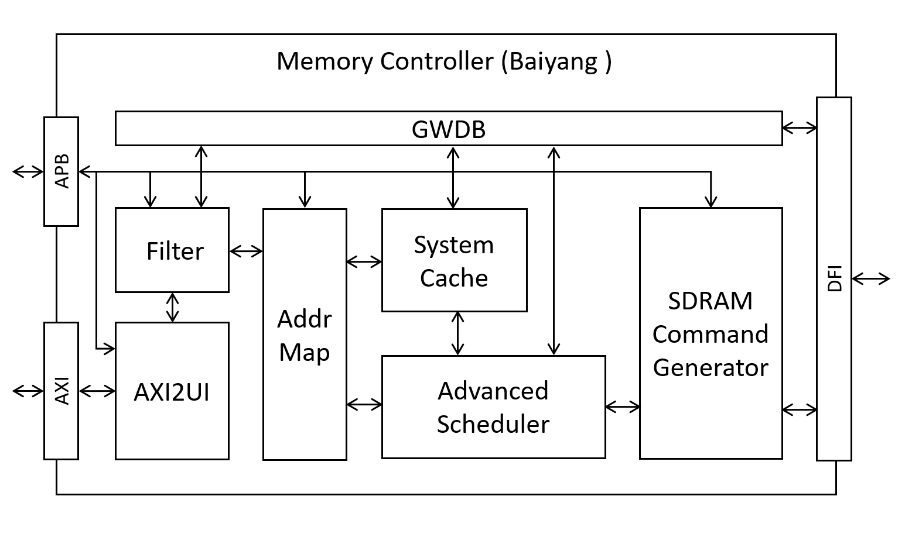
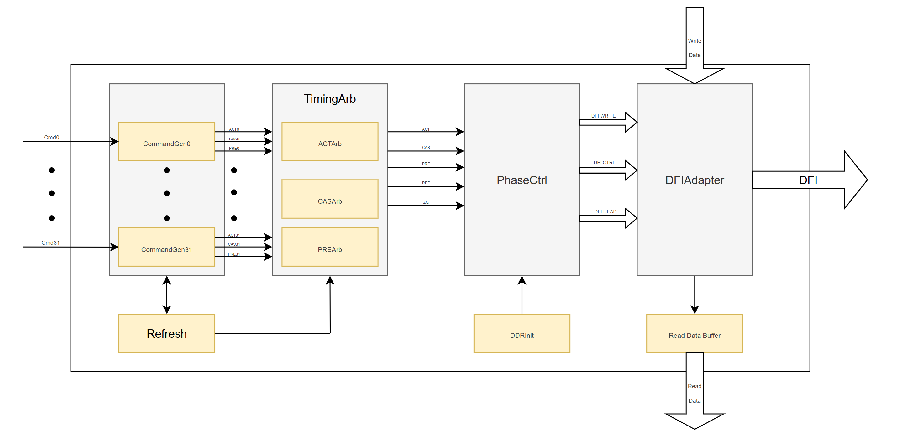
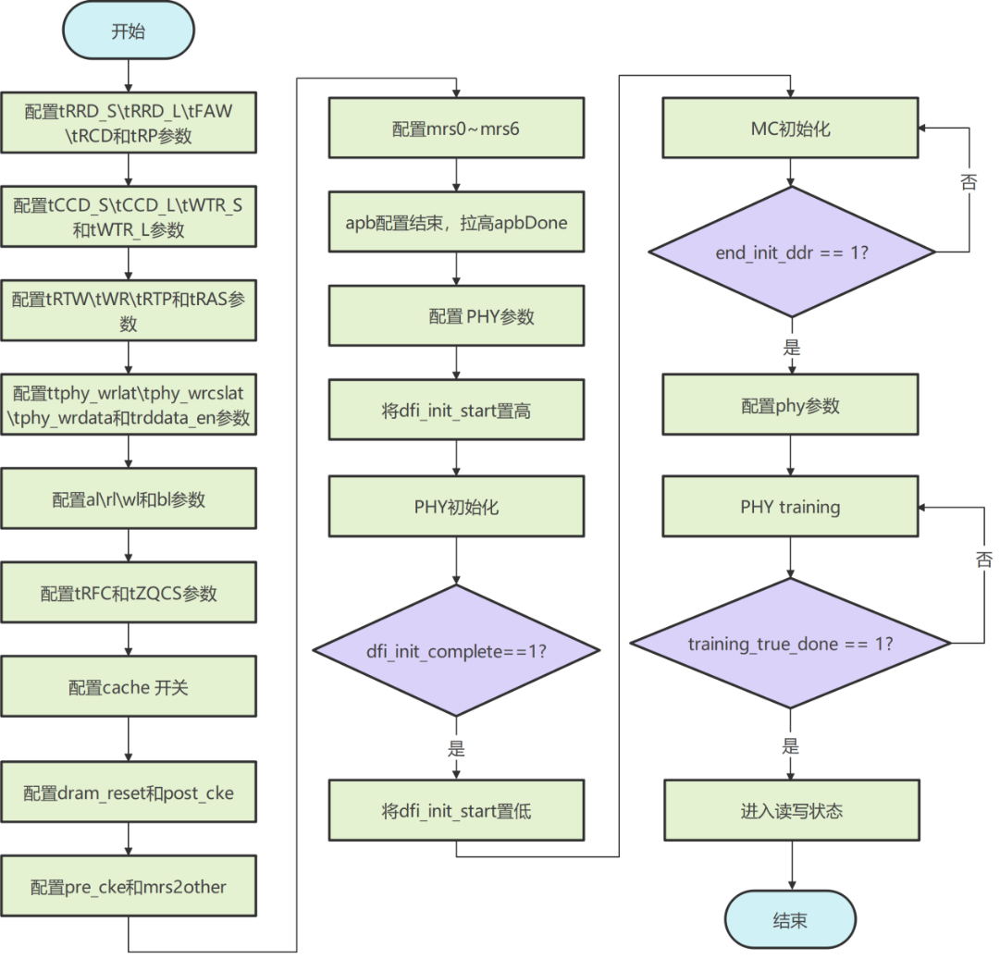

*  **
# Baiyang IP设计文档
*  **

- [总述](#总述)
- [AXI2UI设计说明](#axi2ui设计说明)
- [Filter设计说明](#filter设计说明)
- [Addr Map设计说明](#addr-map设计说明)
- [System Cache设计说明](#system-cache设计说明)
- [Advanced Scheduler设计说明](#advanced-scheduler设计说明)
- [SDRAM Command Generator设计说明](#sdram-command-generator设计说明)
- [APBSlv设计说明](#apbslv设计说明)
- [Write data buffer设计说明](#write-data-buffer设计说明)
  - [维护](#维护)
  - [贡献者 ✨](#贡献者-)
  - [LICENSE](#license)

# 总述

开源高性能DDR4内存控制器 IP (玉泉系列“白杨” IP , Baiyang)包括地址映射、分流、系统缓存、调度等功能模块，支持DDR4-2400内存工作频率，支持AXI4 协议、DFI3.1协议。功能方面，经SPEC CPU2006 Full Trace访存压力测试验证正确性；性能方面，集成香山昆明湖-v2核，在帕拉丁验证环境下，基于SPEC CPU2006 基准测试（ref, int+float）跑分评估可达 14分/GHz。

Baiyang IP整体结构如图1‑1所示，包括协议转换、地址映射、分流、系统缓存、调度和命令生成功能模块。

AXI2UI模块包括ar/aw/r/w/b通道缓冲、仲裁、寄存等逻辑，将符合AXI4协议的读写请求拆分为UI(user interface)接口的读写请求，通过读写通道发送给下一级。从UI接口收取的读数据，要经过重排序返回给AXI接口。

AddrMap模块适应不同bank/row/col地址组合解析SDRAM地址(rank/bank/bank group/row/column)。

Filter模块获取读写请求地址后，根据filter策略，一部分送入Advanced Scheduler，一部分送入System Cache。

System Cache模块实现系统级缓存，提升读写性能。

Advanced Scheduler模块实现读写请求的多bank调度，充分利用内存颗粒的开关行特性，减少访存请求的执行时间。

SDRAM Command Generator模块实现DFI接口的命令调度和拆分，匹配内存颗粒的访存时序要求，保证读写内存正确性。

Global Write Data Buffer模块缓存住所有的写数据，等待SDRAM Command Generator产生DFI写请求时取出。

各模块的详细设计见后续章节。

<figure>

<figcaption>
图1‑1 Baiyang IP整体结构图
</figcaption>
</figure>

# AXI2UI设计说明

AXI2UI模块内部结构图如图2‑1所示。

<figure>

<figcaption>
图2‑1 AXI2UI模块内部结构图
</figcaption>
</figure>

AXI2UI的功能包括以下几点：

（1）读Token的生成：为每个UI Read Command生成一个Token,读Token当前版本只用于Read Reorder Buffer进行重排序。

（2）AXI写突发的拼接：当前版本只支持突发长度为2（len字段为1）且AXI data位宽为256的传输事物，会在后续版本进行完善。

（3）Read Reorder Buffer：Read Reorder Buffer用于将DDRC内部返回的，乱序的读数据重排序为与AXI发送的读命令相同的顺序，再发送至burst_clip中进行拆分。

# Filter设计说明

在获取读写请求地址后先进行同步，然后根据filter策略，一部分送入Advanced Scheduler的read queue和write queue，一部分送入cache request queue。支持Bypassa AS 和 SC。

Filter在Baiyang IP中的功能包括以下几点：

（1）可通过外部配置不同的功能，可配置选项有分流策略和分流地址范围。

可通过mode接口进行功能配置：0（bypass cache），1（bypass schedule），2（split分流功能）。分流地址范围由addr_boundary接口决定，在范围内的分流至SC。
addr_boundary[ADDR_WIDTH\*2-1:ADDR_WIDTH\]决定分流的高位地址。
addr_boundary[ADDR_WIDTH-1:0\]决定分流的低位地址。

（2）wcache_en、rcache_en信号指示是否将读写命令数据分流至SC，高电平有效。

# Addr Map设计说明

Addr Map在Baiyang IP中的功能包括以下几点：Addr Map主要实现地址解析功能。将输入的读写命令地址映射为SDRAM物理地址(rank, bank,bankgroup, row, column)，与Filter、Cache、AS分别有读写命令通道和读写数据通道进行交互，根据WrIsToAS/RdIsToAS指示将拆分后的命令与数据转发给CaChe/As，同时保留MEM_ADDR_MAP参数实现用户灵活配置。

Addr Map整体结构如图4‑1所示。

<figure>

<figcaption>
图4‑1 Addr Map整体结构图
</figcaption>
</figure>

# System Cache设计说明

该模块默认关闭状态，后续调优迭代演进。

System Cache模块实现从filter收cmd和wdata，如果读cmd 命中，cache 将读数据直接返回给filter；如果cmd 未命中，cache需要发cmd和wdata 给下级 advanced scheduler， miss 的读请求数据会从advanced scheduler回来。

# Advanced Scheduler设计说明

Advanced Scheduler的功能包括以下几点：

1、接收Filter和CACHE的读写请求，打上一位的tag以区分请求是来自何处，按接收顺序放入bg位所对应的调度队列中，并保证读写一致性。

2、按照读写、请求到达时间、行命中情况对请求进行调度，总计32条调度流，具体实现是带掩码的年龄矩阵。

3、接收SCG返回的读数据以及读token，根据读token中的tag将数据路由到Filter或者CACHE。

Scheduler模块的内部结构如图6‑1所示。

<figure>

<figcaption>
图6‑1 Advanced Scheduler接口框图
</figcaption>
</figure>

# SDRAM Command Generator设计说明

SDRAM Command Generator模块接收来自Scheduler模块的命令（携带地址以及Token信息），内部状态机根据维护的Row Page来生成DDR4需要的ACT/PRE/CAS等命令，并检查上述命令是否满足设定的DDR4时序。此外，在APB模块配置结束后SCG会产生一系列满足DDR4时序的命令序列对DDR4颗粒进行初始化。PhaseCtrl模块和DFIAdapter模块对满足时序的命令根据DFI3.1进行转化，保证DFI读写通道的时序。

SCG内部结构如图7‑1所示。

<figure>

<figcaption>
图7‑1 SDRAM Command
Generator整体模块架构图
</figcaption>
</figure>

# APBSlv设计说明

APBSlv模块功能包含：接收APB主机发送的初始化序列，划分不同模块的地址实现寄存器的地址映射，数据的跨时钟域传输。

Baiyang IP从上电开始到能正常读写，需采用的初始化步骤如图8‑1所示。

<figure>

<figcaption>
图8‑1 Baiyang IP初始化序列
</figcaption>
</figure>

以 DDR4-2400 参数配置为例，说明Baiyang IP的初始化配置。

<table>
<caption>
表8‑1 初始化配置说明
</caption>
<colgroup>
<col style="width: 29%" />
<col style="width: 17%" />
<col style="width: 22%" />
<col style="width: 30%" />
</colgroup>
<thead>
<tr>
<th>寄存器（高位以**代替）</th>
<th>执行操作</th>
<th>对应值</th>
<th>配置参数</th>
</tr>
</thead>
<tbody>
<tr>
<td>0x****0000</td>
<td>Write</td>
<td>0x10620410</td>
<td>配置tRRD_S、tRRD_L、tFAW、tRCD、tRP</td>
</tr>
<tr>
<td>0x****0004</td>
<td>Write</td>
<td>0x0406161c</td>
<td>配置tCCD_S、tCCD_L、tWTR_S、tWTR_L</td>
</tr>
<tr>
<td>0x****0008</td>
<td>Write</td>
<td>0x0a180a36</td>
<td>配置tRTW、tWR、tRTP、tRAS</td>
</tr>
<tr>
<td>0x****0014</td>
<td>Write</td>
<td>0x0800000c</td>
<td>配置ttphy_wrlat、tphy_wrcslat、tphy_wrdata、trddata_en</td>
</tr>
<tr>
<td>0x****0028</td>
<td>Write</td>
<td>0x00000c08</td>
<td>配置al、rl、wl和bl</td>
</tr>
<tr>
<td>0x****0010</td>
<td>Write</td>
<td>0x00029680</td>
<td>配置tRFC、tZQCS</td>
</tr>
<tr>
<td>0x****0100</td>
<td>Write</td>
<td>0x00000000</td>
<td>配置cache</td>
</tr>
<tr>
<td>0x****0040</td>
<td>Write</td>
<td>0x00100145</td>
<td>配置dram_reset和post_cke</td>
</tr>
<tr>
<td>0x****0044</td>
<td>Write</td>
<td>0x00005018</td>
<td>配置pre_cke和mrs2other</td>
</tr>
<tr>
<td>0x****0048</td>
<td>Write</td>
<td>0x00008020</td>
<td>配置mrs2mrs和tZQININT</td>
</tr>
<tr>
<td>0x****004c</td>
<td>Write</td>
<td>0x00010a30</td>
<td>配置mrs1和mrs0</td>
</tr>
<tr>
<td>0x****0050</td>
<td>Write</td>
<td>0x00000018</td>
<td>配置mrs3和mrs2</td>
</tr>
<tr>
<td>0x****0054</td>
<td>Write</td>
<td>0x00400000</td>
<td>配置mrs5和mrs4</td>
</tr>
<tr>
<td>0x****0058</td>
<td>Write</td>
<td>0x00000800</td>
<td>配置mrs6</td>
</tr>
<tr>
<td>0x****0ff4</td>
<td>Write</td>
<td>0x00000001</td>
<td>apbDone</td>
</tr>
<tr>
<td colspan="4">-----根据PHY手册，配置 PHY 初始化参数-----</td>
</tr>
<tr>
<td>0x****0034</td>
<td>Write</td>
<td>0x00000001</td>
<td>置高dfi_init_start</td>
</tr>
<tr>
<td>0x****0038</td>
<td>read</td>
<td>
0：PHY未初始化结束

1：PHY初始化结束
</td>
<td>轮询，一直到PHY初始化结束</td>
</tr>
<tr>
<td>0x****0034</td>
<td>Wire</td>
<td>0x00000000</td>
<td>拉低dfi_init_star</td>
</tr>
<tr>
<td>0x****003c</td>
<td>read</td>
<td>
0:MC初始化中

1：MC初始化结束
</td>
<td>轮询，直到MC初始化结束</td>
</tr>
<tr>
<td colspan="4">-----根据PHY手册，配置PHY training参数------</td>
</tr>
</tbody>
</table>

# Write data buffer设计说明

Write data buffer模块功能：暂存Filter和System Cache下发的写数据，待调度后取出。

此前的设计中，下发到scheduler的写请求携带对应的数据，经过调度后按照bank ID进行分派下发到SDRAM Command Generator。以双rank配置下的MC为例，共32个bank，每个bank接收写请求都需要额外接收512bit数据和64bit掩码，但显然数据和掩码在调度过程中是不必要的，因此引入写数据缓冲区。

Scheduler中每个bank group有一个写调度队列、共8个bank group，每个调度队列深度由参数WrSchedulerQueueDepth指定。此外，SDRAM
Command Generator的子模块CommandGen中包含一个深度为1的队列、共32个CommandGen。综上，Write data buffer需要覆盖所有队列都满的情况，因此总容量为WrSchedulerQueueDepth\* 8 + 32。

Write data buffer由数据存储体、掩码存储体和可用地址队列组成。由于总容量并非2的整数次幂，数据存储体和掩码存储体分别被拆分为一大一小两个SyncReadMem。可用地址队列在MC解复位时自动填充，在收到下发的写请求时为其分配队头地址作为全局唯一的写token。当写请求经过调度要下发到DDR时，根据写token取出数据存储体中的数据并将写token回收到可用地址队列队尾等待下次分配。当可用地址队列为空时代表MC不能处理新的读请求，阻塞上级模块。

Write data buffer可能同时收到来自Filter和Cache的数据流，在这种冲突的情况下优先处理Cache的请求。

## 维护

<!-- ALL-CONTRIBUTORS-LIST:START -->
<table>
  <tr>
    <td align="center">
      <a href="https://github.com/smieymar">
        
         <b>Mi Song</b>
      </a>
    </td>
  </tr>
</table>
  Email: songmi@ict.ac.cn

<!-- markdownlint-restore -->
<!-- prettier-ignore-end -->
<!-- ALL-CONTRIBUTORS-LIST:END -->
## 贡献者 ✨

<!-- ALL-CONTRIBUTORS-LIST:START - Do not remove or modify this section -->
<!-- prettier-ignore-start -->
<!-- markdownlint-disable -->
<table>
  <tr>
    <!-- 主要作者 -->
    <td align="center" valign="top" width="20%">
      <a href="https://github.com/lijirou123">
        
         
        <b> JunRu Li</b>
      </a>
       
      💻 
    </td>
    <!-- 协作者 -->
    <td align="center" valign="top" width="20%">
      <a href="https://github.com/">
        
         
        <b>BoWen Feng</b>
      </a>
       
      💻 
    </td>
    <td align="center" valign="top" width="20%">
      <a href="https://github.com/dyzrwl">
        
         
        <b>JiaHao Qian</b>
      </a>
       
      💻 
    </td>
    <td align="center" valign="top" width="20%">
      <a href="https://github.com/">
        
         
        <b>Yang Yin</b>
      </a>
       
      💻
    </td>
    <td align="center" valign="top" width="20%">
      <a href="https://github.com/">
        
         
        <b>JinGe Li</b>
      </a>
       
      💻
    </td>
        <td align="center" valign="top" width="20%">
      <a href="https://github.com/">
        
         
        <b>Shuang Wu</b>
      </a>
       
      💻
    </td>
        <td align="center" valign="top" width="20%">
      <a href="https://github.com/">
        
         
        <b>BoFan Shou</b>
      </a>
       
      💻
    </td>
        <td align="center" valign="top" width="20%">
      <a href="https://github.com/">
        
         
        <b>KeChen GU</b>
      </a>
       
      💻
    </td>
  </tr>
</table>
<!-- markdownlint-restore -->
<!-- prettier-ignore-end -->
<!-- ALL-CONTRIBUTORS-LIST:END -->

## LICENSE

Copyright © 2020-2026 Institute of Computing Technology, Chinese Academy
of Sciences.

Copyright © 2021-2026 Beijing Institute of Open Source Chip

Baiyang is licensed under [Mulan PSL v2\](LICENSE).
