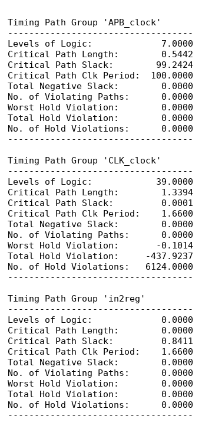
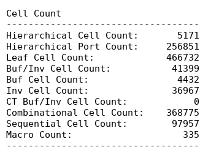
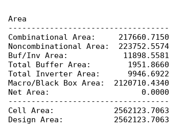
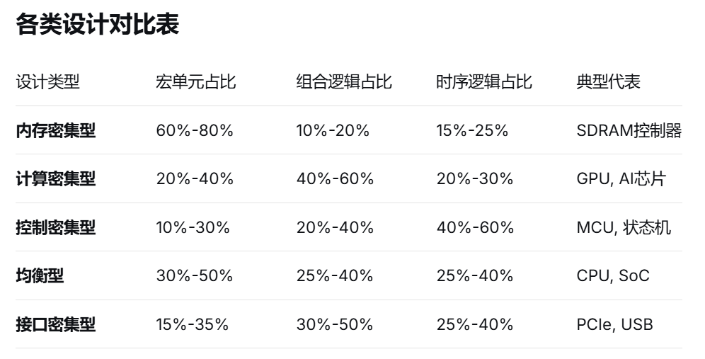
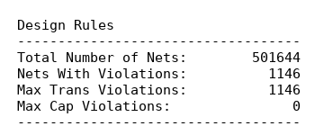
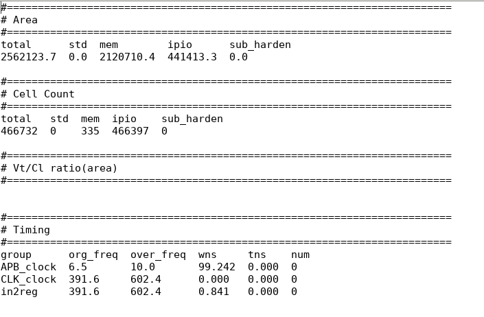
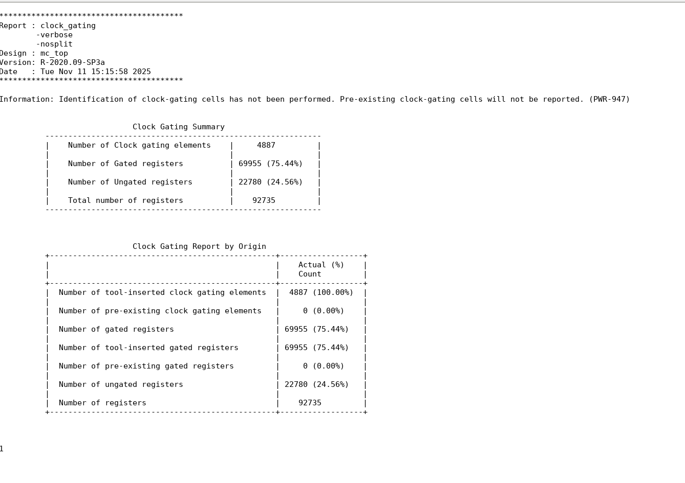
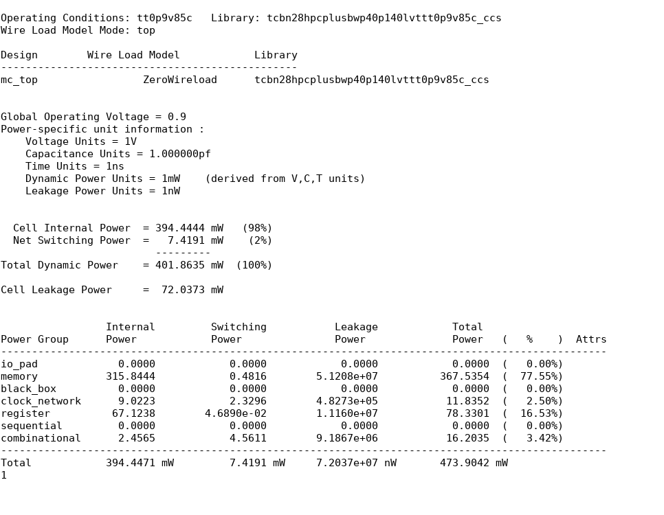

**  **

# Baiyang DC综合报告
**  **

  - [一、qor报告 (Quality of Results Report - 结果质量报告)](#一qor报告-quality-of-results-report---结果质量报告)
  - [1.1 时序路径组分析：](#11-时序路径组分析)
  - [1.2 单元统计](#12-单元统计)
  - [1.3 面积分析](#13-面积分析)
  - [1.4 设计规则违例 (Design Rule Violations - DRVs)](#14-设计规则违例-design-rule-violations---drvs)
- [二、摘要报告 (statistic.rpt)](#二摘要报告-statisticrpt)
- [三、门控时钟分析(Clock Gating Analysis)](#三门控时钟分析clock-gating-analysis)
- [四、功耗分析 (Power Analysis)](#四功耗分析-power-analysis)
  - [作者](#作者)
  - [LICENSE](#license)

本报告是针对Baiyang的DC综合后性能评估，评估芯片设计在“逻辑综合”阶段的质量。逻辑综合是将工程师编写的硬件描述语言（如Verilog/VHDL）代码转换成由基本逻辑门（如与门、或门、非门、寄存器）和宏单元（如RAM, PLL）组成的电路网表的过程。DC会分析这个网表，检查它是否符合设计目标（频率、面积、功耗），并找出潜在的问题。

##  一、qor报告 (Quality of Results Report - 结果质量报告)

这部分是报告的核心，详细评估了设计的时序、面积、单元构成和基本设计规则。

## 1.1 时序路径组分析：

<figure>

<figcaption>
图 1.1时序路径组报告
</figcaption>
</figure>

概念：芯片内部信号需要从一个寄存器传播到下一个寄存器（或输入/输出端口），必须在规定的时间（一个时钟周期）内稳定下来。DC将具有相同时序约束（如时钟）的路径分组分析。关键路径是指组内延迟最大的路径，它决定了该组能达到的最高工作频率。

**APB_clock 组：**

关键路径长度 (Critical Path Length)：0.5442ns，表示该组中最慢的信号从起点到终点需要0.5442纳秒。

裕量 (Critical Path Slack)：+99.2424ns，裕量是我们主要关注的指标，它表示实际路径延迟比要求的时间（时钟周期）快了多少。正值表示有富余时间（好），负值表示路径太慢，无法在要求时间内完成（坏，称为“违例”）。这里巨大的正裕量（99.24ns）意味着这个时钟域非常宽松，性能远超要求，设计在这个时钟域下非常安全、稳定。

结论：时序完全收敛，裕量充足，设计在这个时钟域下完美满足时序要求。

**CLK_clock 组：**

关键路径长度(Critical Path Length)：1.3394 ns。

裕量(Critical Path Slack)：+0.0001ns，这个裕量较小，但一般在对设计进行综合时，为了确保芯片在工艺波动、电压变化等情况下仍满足规格，会设置比规格要求更高的约束，该设计在当前较高的时钟频率下仍能保持时序收敛，说明在正常工作时也不会存在问题。

保持时间违例 (Hold Violation)：最差违例：-0.1041ns，违例路径：6,124条。保持时间是指信号在时钟沿到来之后需要保持稳定的时间。负裕量表示信号变化太快，在接收寄存器采样时可能还未稳定（导致采样到错误值），表明该时钟域存在普遍的保持时间问题，但由于保持时间受后端布局布线时的影响最大，综合工具只会进行一些保守的保持时间检查（使用非常悲观的线负载模型和时钟不确定性），目的是标记出潜在的、严重的保持时间问题，而不是修复所有可能的轻微违例，因此，这部分违例只需在后续物理设计阶段（布局布线）重点修复。

结论：时序收敛，但存在保持时间违例，需在后端阶段进行优化。

**in2reg 组：**

概念：输入到寄存器的路径。通常指芯片输入引脚直接连接到内部寄存器的路径。

逻辑层级 (Levels of Logic=0)：表示输入信号直接连接到寄存器，中间没有经过任何逻辑门。这通常是最简单的路径类型。

结论：无违例，这类路径通常容易满足时序要求，没有问题。

## 1.2 单元统计

<figure>

<figcaption>
图 1.2单元统计报告
</figcaption>
</figure>

概念：统计设计中使用了哪些类型的电路元件（单元）以及它们的数量。

总单元数 (Leaf Cell Count)：466,732，整个设计由40多万个基本单元构成。

组合逻辑单元 (Combinational Cell Count)： 368,775(79.0%)，这些是实现逻辑运算（如AND, OR, XOR, MUX）和信号连接的单元（如Buffer, Inverter）。它们是芯片“计算”功能的核心。

时序逻辑单元 (Sequential Cell Count)：97,957(20.1%)，主要是寄存器（Flip-Flop, Latch），用于存储数据（芯片的“记忆”单元），由时钟信号控制。它们在每个时钟边沿捕获并保存数据。

缓冲器/反相器 (Buf/Inv Cell Count)：41,399(8.87%)，这些是特殊的组合逻辑单元。Buffer用于增强信号驱动能力或平衡延迟；Inverter用于信号取反。它们的数量是衡量信号完整性（如扇出过大）和时钟树/复位树复杂性的一个指标。8.7%的比例相对合理。（5%-15%：对于大多数设计来说是正常范围；\<5%：可能过于乐观，可能存在时序问题；\>15%：可能需要关注信号完整性和优化）

宏单元 (Macro Count)：335个，指设计中使用的、预先设计好的大型功能模块IP核（Intellectual Property），如内存块（RAM, SRAM, ROM）、锁相环（PLL）、复杂的算术单元（如乘法器）等。它们通常由Foundry或IP供应商提供。

## 1.3 面积分析

<figure>

<figcaption>
图 1.3面积报告
</figcaption>
</figure>

概念：分析设计在硅片上占据的面积大小及其构成，面积直接影响芯片成本和功耗。

总面积(Cell/Design Area)：2,562,123.7063 μm²(平方微米)，这是设计在硅片上占据的总物理空间。

组合逻辑面积(Combinational Area)：217,660.7 μm²(8.5%)，实现计算和连接功能的逻辑门所占的面积。比例较低。

时序逻辑面积(Noncombinational Area)：223,752.6 μm²(8.7%)，寄存器所占的面积。比例适中。

宏单元面积(Macro/Black Box Area)：2,120,710.43 μm²(82.8%)，内存（RAM）等大型IP核占据了绝大部分芯片面积。

结论：设计为典型的内存密集型设计。

## 1.4 设计规则违例 (Design Rule Violations - DRVs)

<figure>

<figcaption>
图 1.4设计规则违例报告、
</figcaption>
</figure>

概念：DC会根据工艺库规则检查网表是否符合基本的电气和物理约束，违反这些规则可能导致芯片功能错误或可靠性问题。

Net违例 (Nets with Violations)：1146条，这表示有1146根信号线（Net）的电压翻转速度（从高到低或低到高）太慢，超过了工艺库允许的最大值。这通常是由于信号线驱动的负载（连接的输入引脚）太多（高扇出）或模拟中的连线太长（高负载）造成的。后果：慢的翻转边沿会增加信号传播延迟（影响时序），增加功耗（信号在中间电平停留时间过长），并可能引入噪声敏感性问题。

电容违例 (Max Cap Violations)：0 条，表示没有信号线连接的负载电容超过了工艺库允许的最大值。这与Transition Violation密切相关，通常一起出现。0条是好消息。

结论：存在1146条信号翻转速度问题。这需要在后端布局布线（P&R）阶段重点优化，后端工具可以通过插入Buffer、优化布局（缩短长线）、调整单元驱动强度等方式来修复这些违例。

# 二、摘要报告 (statistic.rpt)

<figure>

<figcaption>
图 2.1摘要报告
</figcaption>
</figure>

概念：这是对qor报告关键指标的总结。其中面积（Area），单元数量（Cell Count）以及时序（Timing）中的裕量（wns）已经在qor报告中进行了分析。

Timing部分解释：

org_freq (原始频率)：设计最初预期的目标工作频率。

over_freq(综合频率)：在DC综合时实际使用的、比org_freq更严格的约束频率（通常更高）。这是为了给后端物理设计阶段（布局布线会引入实际线延迟）留出裕量。

关系：over_freq × 频率系数 (0.65) ≈ org_freq（602.4 x 0.65 = 391.6）。这里的系数0.65是一个经验值（裕量因子），意味着综合时在更快的频率（over_freq）下达到了时序收敛。

# 三、门控时钟分析(Clock Gating Analysis)

<figure>

<figcaption>
图 3.1门控时钟报告
</figcaption>
</figure>

概念：门控时钟（Clock Gating）是最重要的低功耗设计技术之一。其核心思想是：当寄存器组里的数据不需要更新时，关闭（门控）它们的时钟输入。这样可以阻止时钟信号在这些寄存器上不必要的翻转，从而大幅降低动态功耗（尤其是寄存器内部的功耗和时钟树功耗）。

门控寄存器数量 (Number of Gated registers)：69,955（75.44%），设计中有75.44%的寄存器被时钟门控逻辑控制。比例越高，说明设计中无效时钟翻转被抑制得越好，功耗优化越充分，大于80%通常被认为效果较好。

时钟门控单元 (Number of Clock gating elements)：4887个，实际插入的实现门控功能的特殊逻辑单元（通常是集成门控单元ICG）。

平均扇出 (Average Fanout per CG Cell)：69,955 个寄存器 / 4887 个CG Cell≈ 14个寄存器/CG Cell，这表示平均每个时钟门控单元控制着14个寄存器。

结论：每个门控单元控制10-20个寄存器被认为是比较理想的范围（效率与灵活性的平衡）。14个处于这个理想范围内，说明门控的力度适中，既有效地节省了功耗，又没有因为门控单元过多而带来显著的面积和功耗开销。

# 四、功耗分析 (Power Analysis)

<figure>

<figcaption>
图 4.1功耗报告
</figcaption>
</figure>

概念：估算设计在特定工作条件下的功耗消耗。

总功耗 (Total Power)：473.9 mW (毫瓦)，设计在给定工作条件下的整体功耗。

功耗构成 (Breakdown):

（1）内存模块 (Memory)：367.54 mW(77.55%)，内存的功耗占据主导部分，这与面积分析结论一致，验证了设计是内存密集型。SRAM/寄存器文件（Cache配置为2M）是主要的功耗来源。

（2）时钟网络 (Clock Network)：11.84 mW(2.5%)，时钟树（将时钟信号分发到所有寄存器的网络）消耗的功耗，这个比例较高。

（3）寄存器 (Register)： 78.33 mW(16.53%)，寄存器单元本身（不包括时钟网络）消耗的功耗。主要包括数据输入端的组合逻辑功耗和内部节点功耗。门控时钟也直接降低了这部分功耗。

（4）组合逻辑 (Combinational)：16.2 mW (3.42%)，所有组合逻辑门（AND, OR, MUX等）在信号翻转时消耗的功耗。比例最低，说明计算逻辑本身不是主要耗电部分。

结论：设计功耗主要依赖内存，时钟网络功耗控制极其出色，这得益于高比例、高效率的门控时钟实现，寄存器功耗占第二位，组合逻辑功耗占比很小。

## 作者

<!-- ALL-CONTRIBUTORS-LIST:START -->
<table>
  <tr>
    <td align="center">
      <a href="https://github.com/XinWeiHU">
        
         <b>XinWei Hu</b>
      </a>
    </td>
  </tr>
</table>

<!-- markdownlint-restore -->
<!-- prettier-ignore-end -->
<!-- ALL-CONTRIBUTORS-LIST:END -->

## LICENSE

Copyright © 2020-2026 Institute of Computing Technology, Chinese Academy
of Sciences.

Copyright © 2021-2026 Beijing Institute of Open Source Chip

Baiyang is licensed under [Mulan PSL v2\](LICENSE).

