**  **

# Baiyang IP “万众一芯”验证环境覆盖率测试报告

**  **

  - [一、验证环境：](#一验证环境)
  - [二、各模块代码覆盖率](#二各模块代码覆盖率)
  - [三、各模块功能点介绍](#三各模块功能点介绍)
  - [四、功能点和测试点](#四功能点和测试点)
  - [作者](#作者)
  - [LICENSE](#license)

## 一、验证环境：

Baiyang IP各模块采用“万众一芯”芯片验证平台提供的picker工具和UCAgent工具

Picker工具：

<https://github.com/XS-MLVP/picker>

UCAgent工具：

<https://github.com/XS-MLVP/UCAgent>

## 二、各模块代码覆盖率

**1. AddrMap模块**

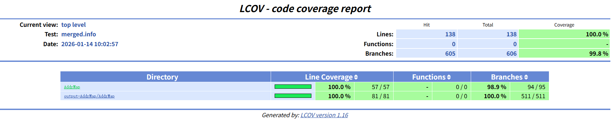
    
  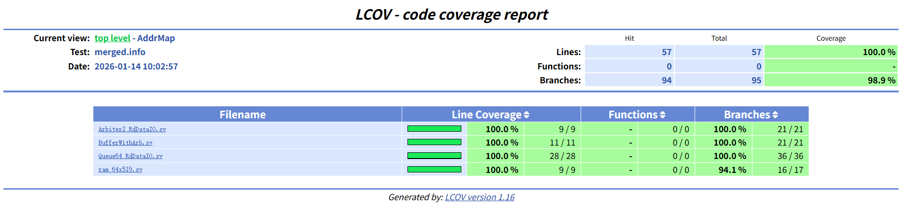

**2. APBSlv模块**

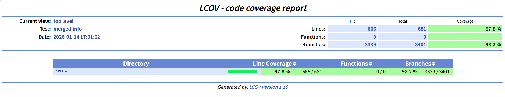

**3. AXI2UI模块**

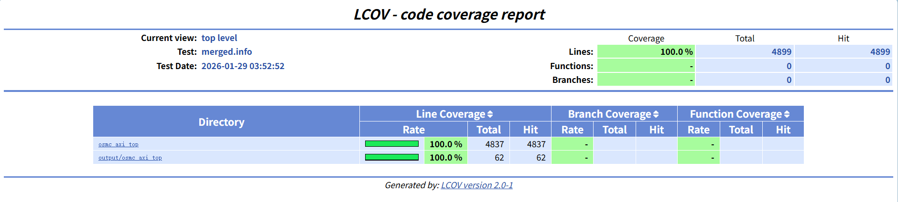

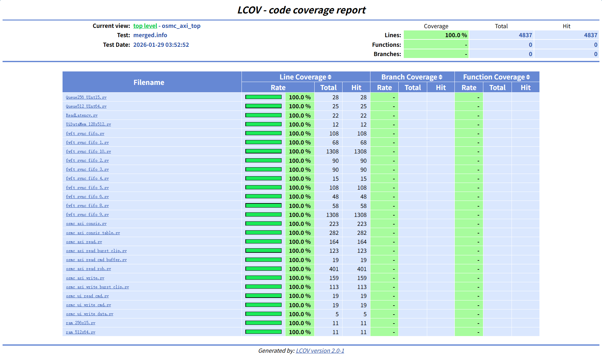

**4. Cache模块**

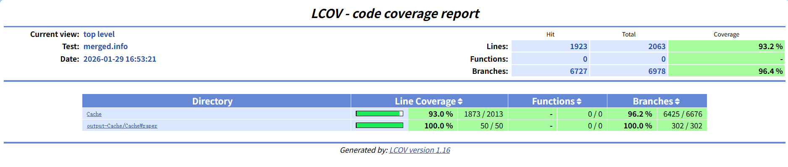

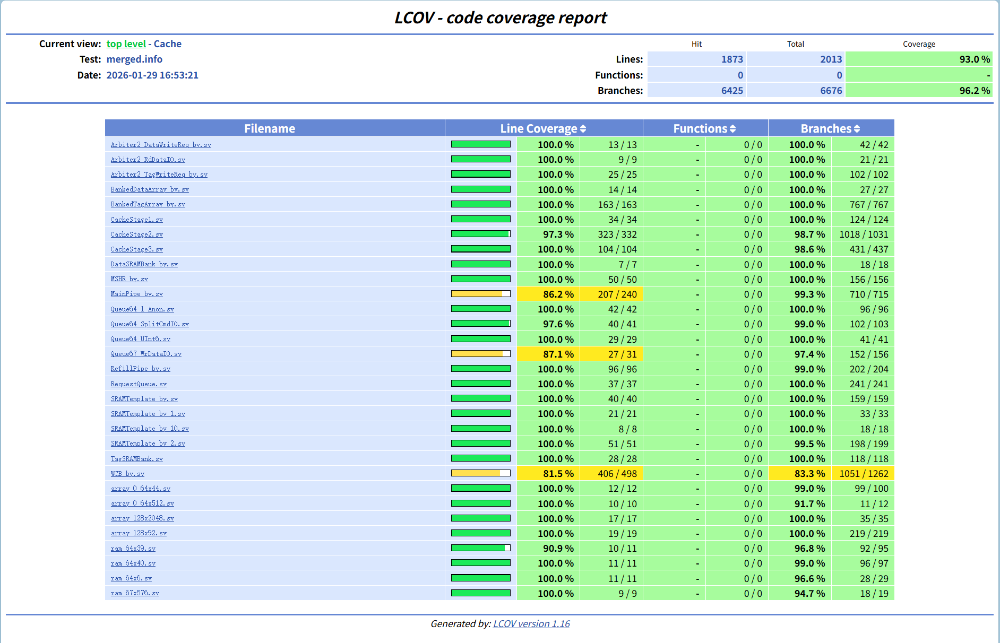

**5. Filter模块**

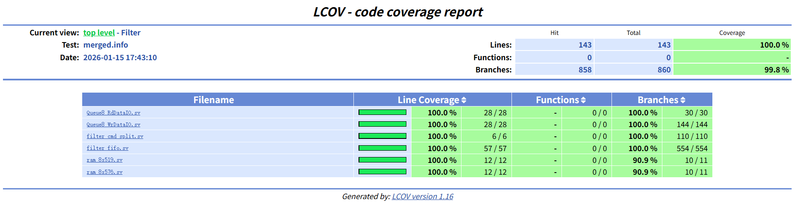

**6. GWDB模块**

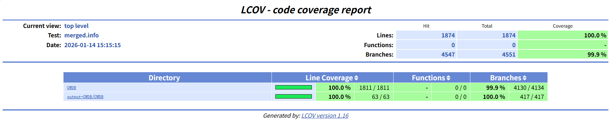

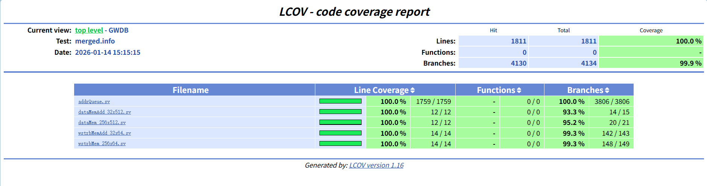

**7. SCG_V3模块**

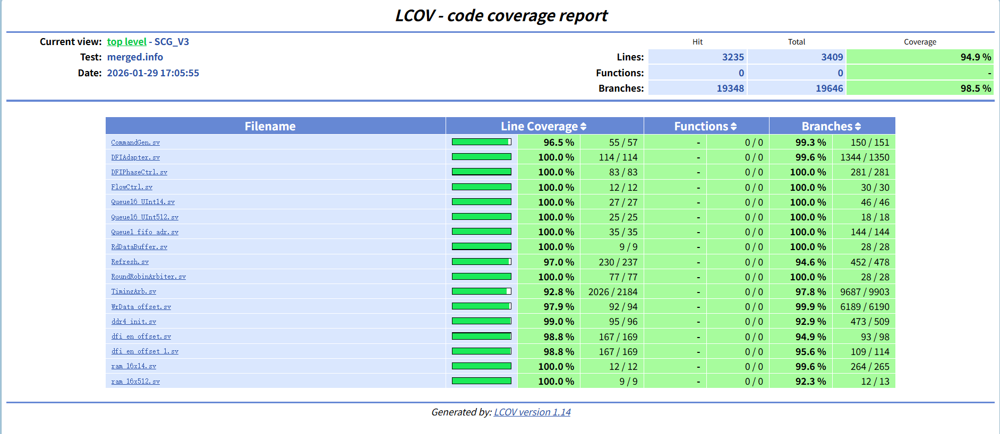

**8. Scheduler模块**

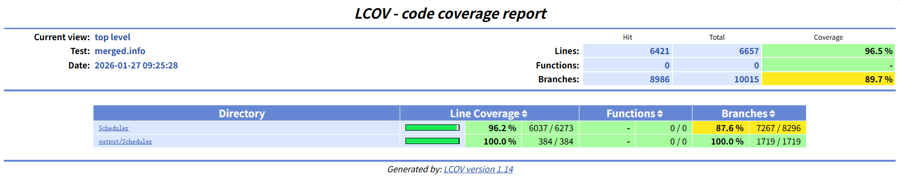
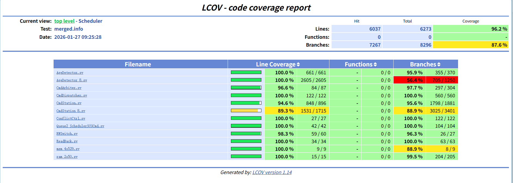

## 三、各模块功能点介绍

**1. AddrMap模块**

AddrMap模块主要实现地址解析功能：将输入的读写命令地址映射为SDRAM物理地址，接收来自Filter模块的读写命令和读写数据与Cache、AS模块进行交互，根据WrIsToAS/RdIsToAS指示将拆分后的命令与数据转发给Cache/AS。

**功能概述**:

- 地址映射：将36位输入地址拆分为rank、bg、bank、row、col等物理地址字段

- 路径选择：根据RdIsToAS和WrIsToAS信号选择发往Cache或AS

- 信号转发：将Filter的读写命令和数据转发到目标模块

- 时序控制：实现valid/ready握手协议和反压处理

- 数据缓冲：使用BufferWithArb模块处理读数据缓冲

**2. APBSlv模块**

APBSlvtop是一个APB（Advanced Peripheral Bus）从设备模块，主要功能是根据输入APB协议地址和数据进行配置下发和状态回读。

**功能概述**:

- APB协议处理：实现APB总线协议的读写操作

- 寄存器访问：内部寄存器读写和地址映射

- 配置输出：向外部模块输出配置参数和时序参数

- 状态回读：从外部模块读取状态信息

**3. AXI2UI模块**

osmc_axi_top是一个将标准AXI4接口转换为内部自定义UI协议的桥接器。

**功能概述**:

- 协议转换：将AXI4协议转换为UI协议，包括数据拼接/拆分

- 乱序重排序：读数据支持乱序返回，通过ROB保证最终顺序

- 内存一致性：检测读写地址冲突，防止数据不一致

- Token机制：128个并发token支持高并发处理

- 突发传输：读写操作总是突发传输，突发长度为2

**4. Cache模块**

Cache模块从AddrMap接收cmd和wdata，如果读cmd命中，返回读数据给AddrMap。如果cmd未命中，需要发cmd和wdata给advanced
scheduler，miss的读请求数据会从advanced scheduler回来。

**功能概述**:

- RequestQueue：将来自AddrMap的读写两路数据合成一路

- CacheArray：分为tagArray和dataArray，不同Bank读写请求可以并行

- MainPipe：三级流水线设计，通过读CacheArray信息判断请求是否命中

- MSHR：接收MainPipe传来的读请求，将存储的读请求发送给AS

- WCB：接收MainPipe传来的写请求和写数据，支持查找同地址冲突

- RefillPipe：将miss read读回的数据回填CacheArray，同时返回读数据给上层

**5. Filter模块**

filter_top模块是一个过滤器模块，主要功能是获取来自AXI模块的读写请求地址，先进行同步，然后根据filter策略进行分流。

**功能概述**:

- 地址分流：根据配置的地址边界和模式，将请求分流到不同队列

- 冲突检测：检测读写命令之间的冲突

- FIFO管理：管理读写命令和数据的FIFO队列

- 计数统计：统计读写命令和返回的数量

- 信号同步：同步各种输入输出信号

- 配置管理：通过配置寄存器控制模块行为

**6. GWDB模块**

GWDB模块是一个写数据缓冲模块，统一接收来自Addrmap和Cache两路写请求的写命令和写数据。

**功能概述**:

- 请求冲突仲裁：检测Addrmap和Cache同时请求的情况并进行仲裁

- 命令令牌管理：为Addrmap和Cache命令分配令牌

- 写数据缓存：写数据分通路缓存（普通256x512 + 附加32x512）

- 写使能缓存：写使能分通路缓存（普通256x64 + 附加32x64）

- 命令转发：将写命令转发至AS

- 数据输出：根据令牌选择对应的缓存数据输出到DFI

**7. SCG_V3模块**

SCG_V3是一个完整的DDR4内存控制器模块，支持多通道、多Rank/Bank的内存访问控制，提供标准的DFI3.1接口与PHY层通信。

**功能概述**:

- 命令调度与仲裁：32个独立命令通道的轮询仲裁

- 时序管理：同Bank、跨Bank、跨Rank时序约束

- 刷新功能：正常刷新、2x刷新、4x突发刷新、ZQ校准

- DDR4初始化：上电初始化序列、MRS0~MRS6配置

- 数据通路：512位数据总线的正确传输和令牌匹配

- DFI接口：与PHY层的正确交互（控制、写数据、读数据、状态、更新、训练、低功耗）

- 握手协议：命令通道、写数据、读数据的valid-ready握手协议

**8. Scheduler模块**

Scheduler是一个多端口DRAM命令调度器，用于管理和调度DRAM访问命令。

**功能概述**:

- 命令路由：根据rank和bg将命令分发到对应的输出端口

- 命令仲裁：在filterCmd和cacheCmd之间进行公平仲裁

- 冲突检测：检测命令在同一bank/row/col的冲突

- 年龄管理：维护命令之间的年龄关系，防止饥饿

- 读写切换：在读取和写入之间进行仲裁

- 数据回传：处理从SCG返回的数据，分发到Cache和Filter

- 队列管理：管理命令队列，支持流控

## 四、功能点和测试点

**1. AddrMap模块**

AddrMap模块的功能可以大致分为以下几种：

**地址映射功能**：

- 读命令地址映射

- 写命令地址映射

- 根据ADDRMAP信号选择不同的地址映射算法

**路径选择功能**：

- 读路径选择（发往Cache或AS）

- 写路径选择（发往Cache或AS）

**信号转发功能**：

- 读命令转发

- 写命令转发

- 写数据转发

- 读数据返回

**时序控制功能**：

- valid/ready握手协议实现

- 反压处理机制

**数据缓冲功能**：

- 读数据缓冲

根据每个功能点的行为，可以将功能点拆分为测试点，如下表所示：

表 1: AddrMap模块测试点及解释

| **功能点** | **测试点** | **简述**                   |
|:-----------|:-----------|:---------------------------|
| 地址映射   | 1.1        | 读命令行地址映射正确性     |
|            | 1.2        | 读命令列地址映射正确性     |
|            | 1.3        | 读命令Bank地址映射正确性   |
|            | 1.4        | 读命令Bank Group映射正确性 |
|            | 1.5        | 读命令Rank映射正确性       |
|            | 1.6        | 写命令行地址映射正确性     |
|            | 1.7        | 写命令列地址映射正确性     |
|            | 1.8        | 写命令Bank地址映射正确性   |
|            | 1.9        | 写命令Bank Group映射正确性 |
|            | 1.10       | 写命令Rank映射正确性       |
|            | 1.11       | ADDRMAP=00模式地址映射     |
|            | 1.12       | ADDRMAP=01模式地址映射     |
|            | 1.13       | ADDRMAP=10模式地址映射     |
|            | 1.14       | ADDRMAP=11模式地址映射     |
| 路径选择   | 2.1        | 读命令发往Cache路径        |
|            | 2.2        | 读命令发往AS路径           |
|            | 2.3        | 写命令发往Cache路径        |
|            | 2.4        | 写命令发往AS路径           |
| 信号转发   | 3.1        | 读命令转发到Cache          |
|            | 3.2        | 读命令转发到AS             |
|            | 3.3        | 写命令转发到Cache          |
|            | 3.4        | 写命令转发到AS             |
|            | 3.5        | 写数据转发到Cache          |
|            | 3.6        | 写数据转发到AS             |
|            | 3.7        | 读数据返回令牌正确性       |
| 时序控制   | 4.1        | 读命令valid/ready握手协议  |
|            | 4.2        | 写命令valid/ready握手协议  |
|            | 4.3        | 写数据valid/ready握手协议  |
|            | 4.4        | 读数据valid/ready握手协议  |
|            | 4.5        | 读命令路径反压处理         |
|            | 4.6        | 写命令路径反压处理         |
|            | 4.7        | 写数据路径反压处理         |
| 数据缓冲   | 5.1        | Cache读数据缓冲            |
|            | 5.2        | AS读数据缓冲               |
|            | 5.3        | 读数据仲裁机制             |

**2. APBSlv 模块**

APBSlv模块的功能可以大致分为以下几种：

**APB协议处理功能**：

- APB读写操作处理

- APB握手协议实现

- 地址解码功能

- 错误检测功能

**寄存器访问功能**：

- 内部寄存器读写

- 地址到寄存器映射

- 只读寄存器保护

**配置输出功能**：

- 时序参数配置输出

- DDR配置输出

- Filter配置输出

**状态回读功能**：

- 从外部模块读取状态信息

表 2: APBSlv模块测试点及解释

| **功能点**  | **测试点** | **简述**          |
|:------------|:-----------|:------------------|
| APB协议处理 | 1.1        | APB读操作正确性   |
|             | 1.2        | APB写操作正确性   |
|             | 1.3        | APB握手协议实现   |
|             | 1.4        | APB地址解码正确性 |
|             | 1.5        | APB错误检测       |
| 寄存器访问  | 2.1        | 可读寄存器读取    |
|             | 2.2        | 可写寄存器写入    |
|             | 2.3        | 只读寄存器保护    |
|             | 2.4        | 寄存器地址映射    |
| 配置输出    | 3.1        | 时序参数配置输出  |
|             | 3.2        | DDR配置输出       |
|             | 3.3        | Filter配置输出    |
| 状态回读    | 4.1        | AXI命令计数回读   |
|             | 4.2        | UI命令计数回读    |
|             | 4.3        | Filter状态回读    |

**3. AXI2UI 模块**

osmc_axi_top模块的功能可以大致分为以下几种：

**协议转换功能**：

- AXI写地址到UI写地址的转换

- AXI写数据到UI写数据的转换

- AXI读地址到UI读地址的转换

- UI读数据到AXI读数据的转换

**乱序重排序功能**：

- ROB槽位分配

- Token生成和分配

- 乱序数据的接收和缓存

- 数据按ID顺序重排序

**内存一致性功能**：

- 写地址与读地址冲突检测

- 写地址与写地址冲突检测

- 地址表记录和更新

**流控和背压功能**：

- FIFO满时产生反压

- FIFO空时暂停读取

- Token耗尽时产生ready_stall

**性能计数器功能**：

- AXI读命令计数

- AXI写命令计数

- UI读命令计数

- UI写命令计数

表 3: osmc_axi_top模块测试点及解释

| **功能点** | **测试点** | **简述**                     |
|:-----------|:-----------|:-----------------------------|
| 协议转换   | 1.1        | AXI写地址转换正确性          |
|            | 1.2        | AXI写数据转换（256位→512位） |
|            | 1.3        | AXI读地址转换正确性          |
|            | 1.4        | UI读数据转换（512位→256位）  |
|            | 1.5        | ID保持和匹配                 |
|            | 1.6        | 突发传输处理                 |
| 乱序重排序 | 2.1        | ROB槽位分配正确性            |
|            | 2.2        | Token生成和分配              |
|            | 2.3        | 乱序数据接收和缓存           |
|            | 2.4        | 数据按ID顺序重排序           |
|            | 2.5        | RLAST信号正确输出            |
|            | 2.6        | Token回收                    |
| 内存一致性 | 3.1        | 写地址与读地址冲突检测       |
|            | 3.2        | 写地址与写地址冲突检测       |
|            | 3.3        | 地址表记录和更新             |
|            | 3.4        | 指针管理和环绕               |
|            | 3.5        | 冲突时命令暂停               |
|            | 3.6        | 冲突解除后命令恢复           |
| 流控和背压 | 4.1        | FIFO满时产生反压             |
|            | 4.2        | FIFO空时暂停读取             |
|            | 4.3        | Token耗尽时产生ready_stall   |
|            | 4.4        | Token回收机制                |
|            | 4.5        | Token限制（最大128个）       |
|            | 4.6        | 多层FIFO协同工作             |
| 性能计数器 | 5.1        | AXI读命令计数正确性          |
|            | 5.2        | AXI写命令计数正确性          |
|            | 5.3        | UI读命令计数正确性           |
|            | 5.4        | UI写命令计数正确性           |
|            | 5.5        | UI读回命令计数正确性         |
| 配置和使能 | 6.1        | 配置未完成时阻塞所有事务     |
|            | 6.2        | 配置完成后恢复正常处理       |

**4. Cache模块**

Cache模块的功能可以大致分为以下几种：

**RequestQueue功能**：

- 读写数据合成

- 写请求与写数据同步

- 请求类型指示

- 队列深度管理

- Token比较逻辑

**CacheArray功能**：

- TagArray功能

- DataArray功能

- 不同Bank并行读写

- 同Bank写阻塞读

**MainPipe功能**：

- 三级流水线

- 命中判断

- Hit读写CacheArray

- Miss发往WCB

- Miss发往MSHR

**MSHR功能**：

- 接收读请求

- 发送读请求到AS

- 接收AS读数据匹配

- 发送给RefillPipe

**WCB功能**：

- 接收写请求和数据

- 发送给AS

- 同地址冲突查找

**RefillPipe功能**：

- miss读数据回填CacheArray

- 返回读数据给上层

表 4: Cache模块测试点及解释

| **功能点**   | **测试点** | **简述**                                           |
|:-------------|:-----------|:---------------------------------------------------|
| RequestQueue | 1.1        | 读写数据合成正确性                                 |
|              | 1.2        | 写请求与写数据同步                                 |
|              | 1.3        | 请求类型指示（0写1读）                             |
|              | 1.4        | 队列深度管理（DataQueue深度 - CmdQueue深度 \>= 2） |
|              | 1.5        | rcmd和wcmd同时有效时的token比较逻辑                |
| CacheArray   | 2.1        | TagArray读写正确性                                 |
|              | 2.2        | DataArray读写正确性                                |
|              | 2.3        | 不同Bank读写请求可以并行                           |
|              | 2.4        | 同一cycle内同bank的写请求会阻塞读请求              |
| MainPipe     | 3.1        | 三级流水线正确性                                   |
|              | 3.2        | 通过读CacheArray信息判断请求是否命中               |
|              | 3.3        | hit请求直接读写CacheArray                          |
|              | 3.4        | miss请求发送给WCB                                  |
|              | 3.5        | miss请求发送给MSHR                                 |
| MSHR         | 4.1        | 接收MainPipe传来的读请求                           |
|              | 4.2        | 将存储的读请求发送给AS                             |
|              | 4.3        | 接收AS传回来的读数据匹配读数据和读地址             |
|              | 4.4        | 发送给RefillPipe                                   |
| WCB          | 5.1        | 接收MainPipe传来的写请求和写数据                   |
|              | 5.2        | 将模块内存储的写请求和写数据发送给AS               |
|              | 5.3        | 支持查找同地址冲突                                 |
| RefillPipe   | 6.1        | 将miss read读回的数据回填CacheArray                |
|              | 6.2        | 同时返回读数据给上层                               |

**5. Filter模块**

filter_top模块的功能可以大致分为以下几种：

**地址分流功能**：

- 根据配置的地址边界和模式分流

- 配置寄存器控制

**冲突检测功能**：

- FIFO冲突检测

- 同时操作冲突检测

**FIFO管理功能**：

- 写命令FIFO管理

- 读命令FIFO管理

- 写数据队列管理

- 读数据队列管理

**计数统计功能**：

- 读命令计数

- 写命令计数

- 读返回计数

**信号同步功能**：

- 输入信号同步

- 输出信号同步

表 5: Filter+模块测试点及解释

| **功能点** | **测试点** | **简述**             |
|:-----------|:-----------|:---------------------|
| 地址分流   | 1.1        | 根据配置地址边界分流 |
|            | 1.2        | 根据配置模式分流     |
|            | 1.3        | 配置寄存器正确控制   |
| 冲突检测   | 2.1        | FIFO冲突检测         |
|            | 2.2        | 同时操作冲突检测     |
| FIFO管理   | 3.1        | 写命令FIFO正确管理   |
|            | 3.2        | 读命令FIFO正确管理   |
|            | 3.3        | 写数据队列正确管理   |
|            | 3.4        | 读数据队列正确管理   |
| 计数统计   | 4.1        | 读命令计数正确性     |
|            | 4.2        | 写命令计数正确性     |
|            | 4.3        | 读返回计数正确性     |
| 信号同步   | 5.1        | 输入信号正确同步     |
|            | 5.2        | 输出信号正确同步     |

**6. GWDB模块**

GWDB模块的功能可以大致分为以下几种：

**请求冲突仲裁功能**：

- Addrmap和Cache同时请求检测

- 冲突仲裁处理

**命令令牌管理功能**：

- Addrmap命令令牌分配

- Cache命令令牌分配

- 令牌队列管理

- 令牌出队

**写数据缓存功能**：

- 写数据写入缓存

- 写数据从缓存读取

- 普通数据缓存（256x512）

- 附加数据缓存（32x512）

**写使能缓存功能**：

- 写使能写入缓存

- 写使能从缓存读取

- 普通写使能缓存（256x64）

- 附加写使能缓存（32x64）

**命令转发功能**：

- Addrmap命令转发至AS

- Cache命令转发至AS

**数据输出功能**：

- 数据输出选择（根据令牌选择缓存）

- 数据输出有效信号控制

表 6: GWDB+模块测试点及解释

| **功能点**   | **测试点** | **简述**                         |
|:-------------|:-----------|:---------------------------------|
| 请求冲突仲裁 | 1.1        | 检测Addrmap和Cache同时请求       |
|              | 1.2        | 冲突时Addrmap请求优先处理        |
|              | 1.3        | 冲突时Cache请求优先处理          |
| 命令令牌管理 | 2.1        | 为Addrmap命令分配令牌            |
|              | 2.2        | 为Cache命令分配令牌              |
|              | 2.3        | 令牌队列管理                     |
|              | 2.4        | 令牌出队                         |
| 写数据缓存   | 3.1        | 写数据写入缓存正确性             |
|              | 3.2        | 写数据从缓存读取正确性           |
|              | 3.3        | 普通数据缓存（256x512）正确性    |
|              | 3.4        | 附加数据缓存（32x512）正确性     |
| 写使能缓存   | 4.1        | 写使能写入缓存正确性             |
|              | 4.2        | 写使能从缓存读取正确性           |
|              | 4.3        | 普通写使能缓存（256x64）正确性   |
|              | 4.4        | 附加写使能缓存（32x64）正确性    |
| 命令转发     | 5.1        | Addrmap命令转发至AS正确性        |
|              | 5.2        | Cache命令转发至AS正确性          |
| 数据输出     | 6.1        | 数据输出选择（根据令牌选择缓存） |
|              | 6.2        | 数据输出有效信号控制             |
| 复位控制     | 7.1        | 模块复位正确性                   |
| 计算完成控制 | 8.1        | 计算完成信号处理                 |

**7. SCG_V3模块**

SCG_V3模块的功能可以大致分为以下几种：

**命令调度与仲裁功能**：

- 32个独立命令通道的轮询仲裁

- ACT/CAS/PRE命令调度

- 命令优先级管理

**时序管理功能**：

- 同Bank时序约束

- 跨Bank时序约束

- 跨Rank时序约束

- 读写转换时序

**刷新功能**：

- 正常刷新模式

- 2x刷新模式

- 4x突发刷新模式

- ZQ校准功能

**DDR4初始化功能**：

- DDR4上电初始化序列

- MRS0~MRS6模式寄存器配置

- ZQ初始化

- 降速模式配置

**数据通路功能**：

- 写数据路径

- 读数据路径

- 数据延迟匹配

- 令牌匹配机制

**DFI接口功能**：

- DFI控制信号生成

- 双相位操作

- DFI写数据接口

- DFI读数据接口

- DFI状态接口

- DFI更新接口

**握手协议功能**：

- 命令通道握手协议

- 写数据握手协议

- 读数据握手协议

表 7: SCG_V3模块测试点及解释（部分）

| **功能点**     | **测试点** | **简述**             |
|:---------------|:-----------|:---------------------|
| 命令调度与仲裁 | 1.1        | 32通道轮询仲裁正确性 |
|                | 1.2        | ACT命令调度正确性    |
|                | 1.3        | CAS命令调度正确性    |
|                | 1.4        | PRE命令调度正确性    |
|                | 1.5        | 命令优先级管理正确性 |
| 时序管理       | 2.1        | tRAS时序约束         |
|                | 2.2        | tRCD时序约束         |
|                | 2.3        | tRP时序约束          |
|                | 2.4        | tRRDS时序约束        |
|                | 2.5        | tRRDL时序约束        |
|                | 2.6        | tCCDS时序约束        |
|                | 2.7        | tCCDL时序约束        |
| 刷新功能       | 3.1        | 正常刷新功能         |
|                | 3.2        | 2x刷新功能           |
|                | 3.3        | 4x突发刷新功能       |
|                | 3.4        | ZQ校准功能           |
| DDR4初始化     | 4.1        | DDR4上电初始化序列   |
|                | 4.2        | MRS0寄存器配置       |
|                | 4.3        | MRS1寄存器配置       |
|                | 4.4        | ZQ初始化             |
| 数据通路       | 5.1        | 写数据路径正确性     |
|                | 5.2        | 读数据路径正确性     |
|                | 5.3        | 数据延迟匹配         |
|                | 5.4        | 令牌匹配机制         |
| DFI接口        | 6.1        | DFI控制信号生成      |
|                | 6.2        | 双相位操作           |
|                | 6.3        | DFI写数据接口        |
|                | 6.4        | DFI读数据接口        |
| 握手协议       | 7.1        | 命令通道握手协议     |
|                | 7.2        | 写数据握手协议       |
|                | 7.3        | 读数据握手协议       |

**8. Scheduler模块**

Scheduler模块的功能可以大致分为以下几种：

**命令路由功能**：

- 端口映射

- 命令分发

- 地址解析

**命令仲裁功能**：

- filterCmd/cacheCmd仲裁

- 优先级处理

- 公平性保证

- 多路仲裁

**冲突检测功能**：

- Bank冲突检测

- Row冲突检测

- Col冲突检测

- 跨周期冲突检测

**年龄管理功能**：

- 年龄矩阵维护

- 年龄感知调度

- 饥饿预防

**读写切换功能**：

- 读写仲裁

- 切换策略

- 性能优化

**数据回传功能**：

- 数据接收

- Token匹配

- 数据分发

**队列管理功能**：

- 命令缓冲

- 队列状态管理

- 流控支持

表 8: Scheduler-改模块测试点及解释

| **功能点** | **测试点** | **简述**                                 |
|:-----------|:-----------|:-----------------------------------------|
| 命令路由   | 1.1        | 端口映射正确性（8个组×4个bank=32个端口） |
|            | 1.2        | 命令分发正确性                           |
|            | 1.3        | 地址解析正确性                           |
| 命令仲裁   | 2.1        | filterCmd/cacheCmd仲裁正确性             |
|            | 2.2        | 优先级处理正确性                         |
|            | 2.3        | 公平性保证                               |
|            | 2.4        | 多路仲裁正确性                           |
| 冲突检测   | 3.1        | Bank冲突检测正确性                       |
|            | 3.2        | Row冲突检测正确性                        |
|            | 3.3        | Col冲突检测正确性                        |
|            | 3.4        | 跨周期冲突检测正确性                     |
| 年龄管理   | 4.1        | 年龄矩阵维护正确性                       |
|            | 4.2        | 年龄感知调度正确性                       |
|            | 4.3        | 饥饿预防机制                             |
| 读写切换   | 5.1        | 读写仲裁正确性                           |
|            | 5.2        | 切换策略正确性                           |
|            | 5.3        | 性能优化                                 |
| 数据回传   | 6.1        | 数据接收正确性                           |
|            | 6.2        | Token匹配正确性                          |
|            | 6.3        | 数据分发正确性（到Cache和Filter）        |
| 队列管理   | 7.1        | 命令缓冲正确性                           |
|            | 7.2        | 队列状态管理（空/满）                    |
|            | 7.3        | 流控支持（ready/valid）                  |

## 

## 作者

<!-- ALL-CONTRIBUTORS-LIST:START -->
<table>
  <tr>
    <td align="center">
      <a href="https://github.com/dyzrwl">
        
         <b>JiaHao Qian</b>
      </a>
    </td>
  </tr>
</table>

<!-- markdownlint-restore -->
<!-- prettier-ignore-end -->
<!-- ALL-CONTRIBUTORS-LIST:END -->

## LICENSE

Copyright © 2020-2026 Institute of Computing Technology, Chinese Academy
of Sciences.

Copyright © 2021-2026 Beijing Institute of Open Source Chip

Baiyang is licensed under [Mulan PSL v2\](LICENSE).

